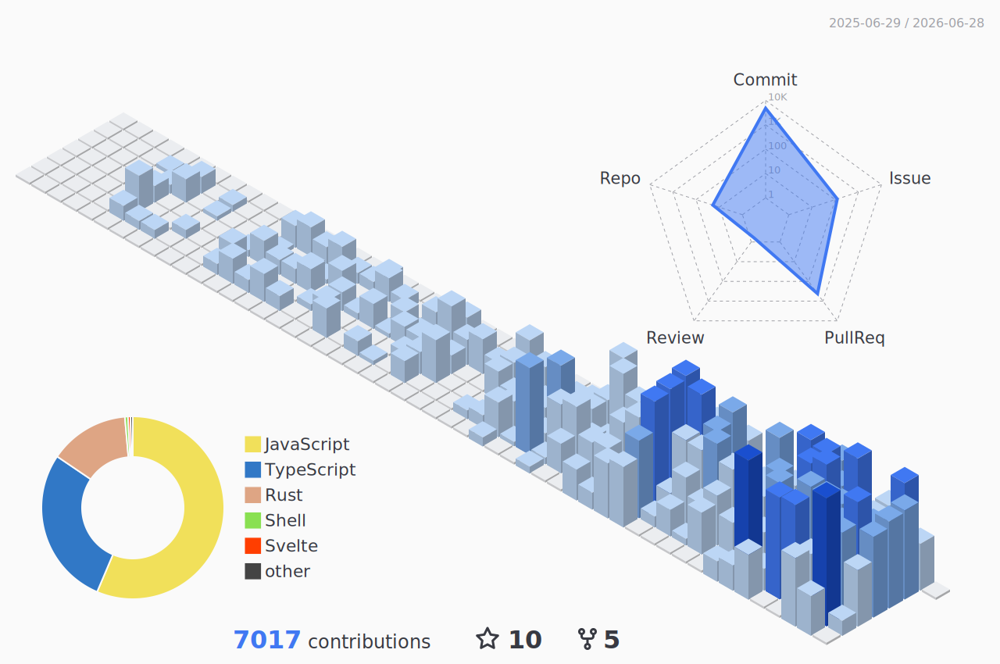

<!--
============================================================
  othavi0 — profile README
  Hero rendered at www.othavio.com/api/hero (Geist Mono, One Dark Pro),
  mirroring othavio.com. 3D contributions generated by profile-3d.yml.
  See NOTES at the bottom.
============================================================
-->

  

### /* open source */

<table>
<tr><td><code>01</code></td><td><b><a href="https://github.com/othavi0/agent-bar">agent-bar</a></b></td><td>author</td><td>Waybar integration and TUI to track Claude Code usage in real time.</td></tr>
<tr><td><code>02</code></td><td><b><a href="https://github.com/othavi0/skills">skills</a></b></td><td>author</td><td>Skill library for Claude Code agents.</td></tr>
</table>

### /* contributions */

<table>
<tr><td><code>01</code></td><td><b><a href="https://github.com/ogulcancelik/herdr">herdr</a></b></td><td>contributor</td><td>Terminal workspace manager to herd your AI coding agents.</td></tr>
<tr><td><code>02</code></td><td><b><a href="https://github.com/rtk-ai/rtk">rtk</a></b></td><td>contributor</td><td>Rust CLI proxy that cuts 60 to 90 percent of LLM tokens on common dev commands.</td></tr>
<tr><td><code>03</code></td><td><b><a href="https://github.com/builderz-labs/mission-control">mission-control</a></b></td><td>contributor</td><td>Open-source dashboard to orchestrate AI agent fleets.</td></tr>
<tr><td><code>04</code></td><td><b><a href="https://github.com/SikandarJODD/svelte-animations">svelte-animations</a></b></td><td>contributor</td><td>Svelte Magic UI and Aceternity components built with Tailwind and Framer Motion.</td></tr>
</table>

  

<!--
NOTES — pendências (não renderiza)
1) Hero vive em othavio-site (app/api/hero). Deploy do site publica em www.othavio.com/api/hero.
2) skills (ex-noctua-skills): repo público, instalável via npx skills add othavi0/skills.
3) O 3D (profile-one-dark.svg) é regenerado diariamente pela Action profile-3d.yml.
-->
